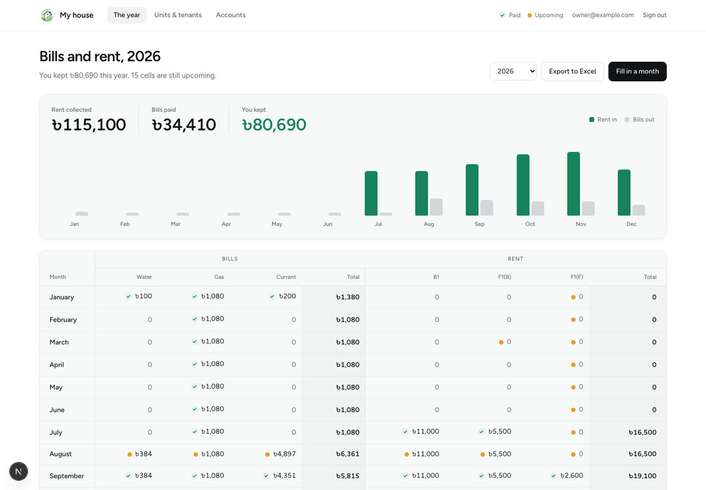
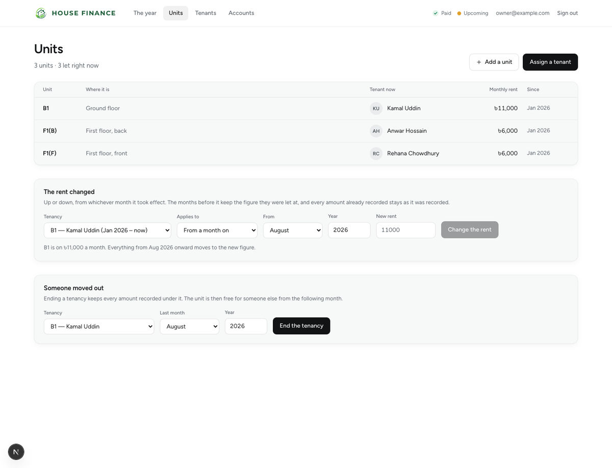
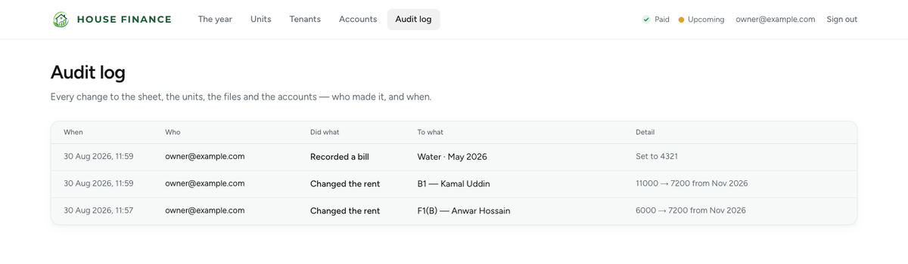
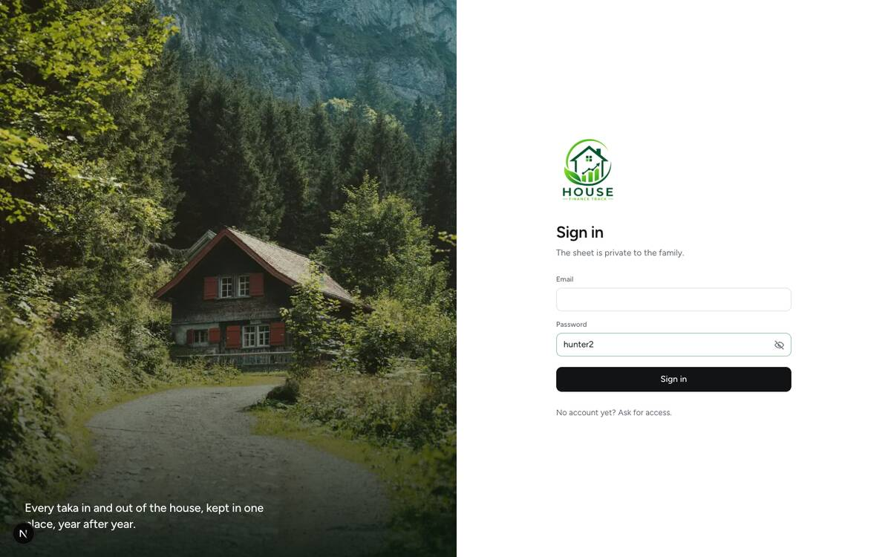

# House Finance Track

A private ledger for a house let out in units. It answers one question for every month of the
year: what came in as rent, what went out as bills, and what was left.

Built for a family house, so it assumes a small number of people who trust each other but still
want a record of who changed what. Everything lives on your own server and your own database.



---

## What it does

- **A year on one sheet.** Twelve months, every bill type across the top, every unit down the
  side, with running totals and a rent-versus-bills chart.
- **Rent that changes.** Rent is not fixed to a tenant — it belongs to a stretch of months. Put
  it up or down from whichever month it took effect and the earlier months keep the figure they
  were actually let at.
- **Units and tenants kept apart.** A unit outlives its tenants and a tenant outlives the unit
  they rented. They meet in a *tenancy*, which has a start, an optional end, and a rent.
- **Closed years stay closed.** The current year is writable. Any earlier year is read-only
  until someone deliberately unlocks it, and the unlock belongs to that one browser session.
- **Tenant files.** Photos and documents go to object storage, are served only through the app
  behind an access check, and are removed from the bucket when they are deleted or replaced.
- **An audit log.** Who changed which figure, when, and what it was before. Owner-only.
- **Accounts with three roles.** The owner runs the house, super-admins keep the sheet, viewers
  can only look.

<p align="center">
  
  
</p>

---

## Requirements

- **Node 20+** (developed on Node 22)
- **Docker** — for the Postgres 17 container in `docker-compose.yml`. Any Postgres 17 will do if
  you would rather run your own; it needs the `btree_gist` extension, which the first migration
  creates.
- **A Cloudflare R2 bucket** (or any S3-compatible store) if you want uploaded files to survive
  a restart. You can run without one while you are trying it out — see
  [Files and storage](#files-and-storage).

---

## Quick start

```bash
git clone https://github.com/Chy-Zaber-Bin-Zahid/House-Finance-Track.git
cd House-Finance-Track
npm install

# 1. Configure
cp .env.example .env.local          # then edit it — see the table below
cp .env.example .env.test           # point DATABASE_URL at the *_test database

# 2. Start Postgres (creates both the app and the test database)
docker compose up -d

# 3. Create the tables
set -a && source .env.local && set +a    # drizzle-kit does not read .env.local on its own
npm run db:migrate

# 4. Optional: load the example house — 3 units, 3 tenants, a year of figures
npm run db:seed

# 5. Run it
npm run dev                          # http://localhost:3000
```

Then sign in with the `OWNER_EMAIL` and `OWNER_PASSWORD` you set. That account is created on
first boot and cannot be registered for.

> **The one thing that trips people up:** `drizzle-kit` does not load `.env.local` the way
> `next dev` does, so `npm run db:migrate` fails with `[x] url: ''` unless you export the
> variables first. That is the `set -a && source .env.local && set +a` line above.

---

## Configuration

Copy `.env.example` to `.env.local`. Never commit either file — `.gitignore` excludes `.env*`
apart from the example.

| Variable | Required | What it is |
| --- | --- | --- |
| `DATABASE_URL` | yes | Postgres connection string. There is no fallback: a migration pointed at a default nobody chose is worse than one that refuses to run. |
| `DB_PORT` | no | Port the compose service publishes on. Defaults to `5437`, so it does not collide with a Postgres you already run. Keep `DATABASE_URL` in step with it. |
| `OWNER_EMAIL` | yes | The owner account, created once on first boot. |
| `OWNER_PASSWORD` | yes | Read only on that first boot. Changing it here afterwards does nothing — change the password in the app. |
| `R2_ACCOUNT_ID` | for files | Cloudflare account id. |
| `R2_ACCESS_KEY_ID` | for files | Token scoped to one bucket. |
| `R2_SECRET_ACCESS_KEY` | for files | " |
| `R2_BUCKET` | for files | Use a separate bucket per environment, so a leaked development credential cannot reach real files. |
| `ALLOW_MEMORY_FILES` | no | Set to `true` to run `next start` without R2 and accept that uploads are lost on restart. |
| `TRUSTED_PROXY_HOPS` | in production | How many proxies sit in front of the app. It decides how far into `X-Forwarded-For` the rate limiter looks. Left unset the header is ignored entirely, callers cannot be told apart, and the per-caller limits do not run — see [Rate limiting](#rate-limiting). |

---

## The screens

| Route | What it is |
| --- | --- |
| `/` | The year — three totals, a rent-versus-bills chart, and the whole sheet |
| `/month/[year]/[month]` | One month — type the amounts, mark each paid or upcoming |
| `/units` | The units, who is in them, and the letting actions |
| `/tenants` | The people |
| `/tenants/[id]` | One tenant — photo, contact, documents, rent history, notes |
| `/accounts` | Approve people and set their role (owner only) |
| `/audit` | Who changed what (owner only) |

A month is reached by picking one out of the year sheet, so the month you land on is always the
one you pointed at.

---

## Who can do what

| | Viewer | Super-admin | Owner |
| --- | :-: | :-: | :-: |
| Read the sheet | ✅ | ✅ | ✅ |
| Change figures, units, tenants, files | | ✅ | ✅ |
| Unlock a closed year | | ✅ | ✅ |
| Approve accounts, set roles | | | ✅ |
| Read the audit log | | | ✅ |

Anyone can ask for access at `/register`; they land in an `awaiting` state and cannot sign in
until the owner approves them and picks a role. A rejected account never can.

Two rules worth knowing:

- **Authorization lives in the data layer**, not in the route handlers, so a route that forgets
  to check still cannot reach the database unguarded. A test asserts this structurally for every
  handler, including ones added later.
- **The year unlock is per session.** Another super-admin looking at the same year still sees it
  read-only, and the unlock dies with the session.

---

## Rate limiting

Four things are limited, in memory, per process:

| Guarded | Limit | Keyed on |
| --- | --- | --- |
| Sign-in | 5 per 15 min | the email |
| Sign-in | 20 per 15 min | the caller's address |
| Registration | 5 per hour | the caller's address |
| Password change | 5 per 15 min | the account |

This is a backstop against **password guessing**, not a defence against a denial
of service. It runs inside the application, so a request has already reached
Node — and often already cost a database round trip — before a counter is
consulted. Anything volumetric has to be stopped in front of the app:
Cloudflare, a WAF, or `limit_req` in nginx.

**The limits keyed on the caller only run when the caller can be identified**,
which needs `TRUSTED_PROXY_HOPS` set to the number of proxies in front of the
app. Without it those limits are skipped rather than applied to everybody at
once — a shared bucket would mean a stranger could spend the household's
allowance and lock everyone out of sign-in, which is the failure a rate limit is
supposed to prevent. The per-email limit still runs either way, and it is the
one that actually protects an account.

The counters live in process memory, so a restart clears them and a second
instance would keep its own.

---

## Files and storage

Uploaded photos and documents are stored in R2 and served **only** through the app, which
re-checks the session on every read. A bucket URL is never handed to a browser, because a link
handed out would outlive the access of the account that fetched it.

Deleting a tenant, deleting a file, or replacing a photo all remove the object from the bucket
as well as the row, so storage does not fill with files nothing references.

Without R2 credentials the app falls back to an in-memory store so you can try it out — uploads
work, access rules all still apply, and everything is lost on restart. In production this
fallback is **refused** rather than applied silently, unless you set `ALLOW_MEMORY_FILES=true`.



---

## Working on it

```bash
npm run dev          # dev server
npm run build        # production build
npm start            # run the production build
npm run typecheck    # tsc --noEmit
npm test             # vitest, against the test database
npm run test:watch

npm run db:generate  # write a migration from a schema change
npm run db:migrate   # apply migrations
npm run db:seed      # load the example house (refuses to run twice)
```

### Migrations

Use `db:generate` then `db:migrate`. **Never `drizzle-kit push`.** The `tenancies` table carries
an `EXCLUDE` constraint and the `btree_gist` extension, hand-written in the first migration
because the schema DSL cannot express them. `push` introspects the live database, sees
constraints it has no way to represent, and offers to drop them.

### Tests

The suite runs against a second database — `docker-compose.yml` creates it — and refuses to run
against one whose name does not mark it as a test database. Point `DATABASE_URL` in `.env.test`
at `..._test` and run:

```bash
npm test
```

It covers the schema's own guarantees (overlap exclusion, cascade behaviour), the data layer,
and a structural check that no route handler is left unguarded.

---

## How it is put together

```
app/          routes — the screens and the JSON API under app/api
components/   the screens and the pieces they share
data/         the data access layer; every authorization check lives here
db/           schema, migrations, seed
lib/          pure helpers shared with the browser (formatting, CSV, types)
test/         suite setup and the cross-cutting assertions
```

- **Next.js 16** (App Router, Turbopack) and **React 19**
- **Postgres 17** via **Drizzle ORM** — the database enforces what it can, including
  non-overlapping tenancies per unit
- **Tailwind CSS 4**, with the palette and radii as theme variables in `app/globals.css`
- **TanStack Query** for server state
- **argon2id** for passwords, sessions as a SHA-256 hash of the cookie token, so a database dump
  yields nothing replayable
- **Vitest** for the tests

Dates are the one place the model is fussy: a tenancy is stored as a Postgres `daterange`, always
half-open `[)`, so a tenancy ending in June and one starting in July touch without overlapping.
The product speaks in months; the extra resolution exists only to let Postgres check overlap.

---

## Deploying

1. Provision Postgres 17 and run `npm run db:migrate` against it.
2. Set every variable in the table above, including real R2 credentials.
3. `npm run build && npm start`.

The owner account is created on the first boot that finds none. Set `OWNER_PASSWORD` to
something real before that first boot, and change it in the app afterwards.

---

## Credits

The sign-in photograph is by [Miłosz Roman](https://unsplash.com/@milosz_roman) on
[Unsplash](https://unsplash.com/photos/1opHGv8iXvg), used under the Unsplash licence. Swap
`public/sign-in.jpg` for your own if you prefer.

## Licence

No licence has been chosen yet, which means default copyright applies and others cannot legally
reuse it. If you want people to use this, add one — [MIT](https://choosealicense.com/licenses/mit/)
is the usual choice for a project like this.
