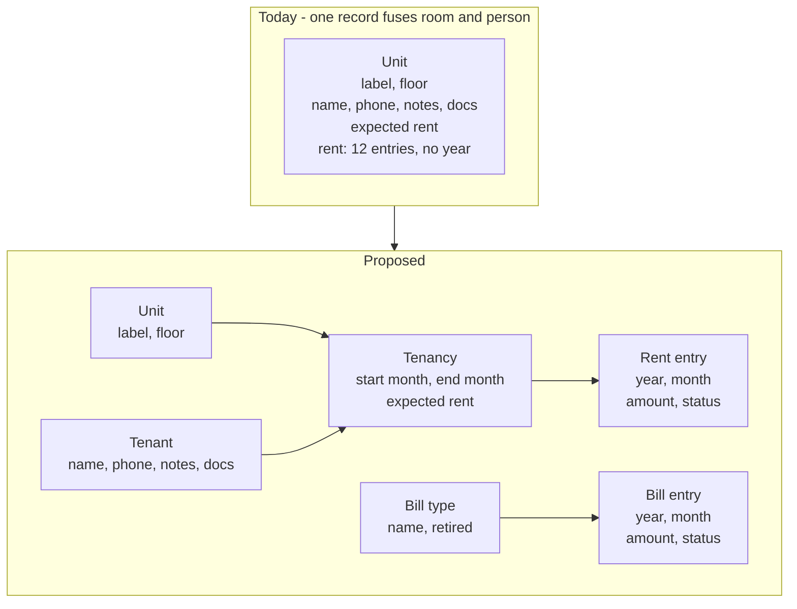
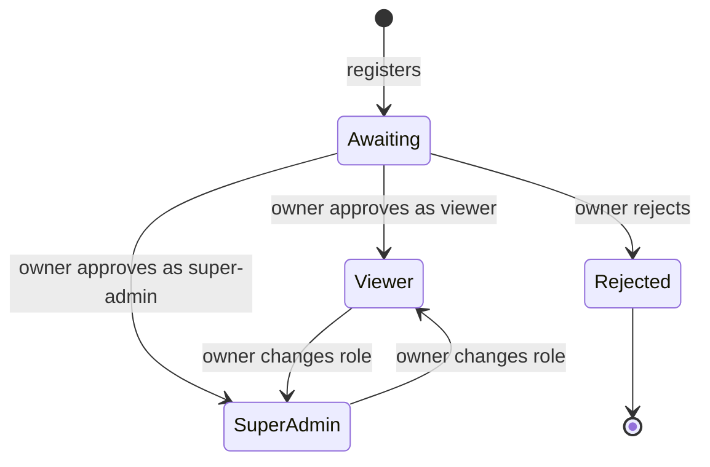
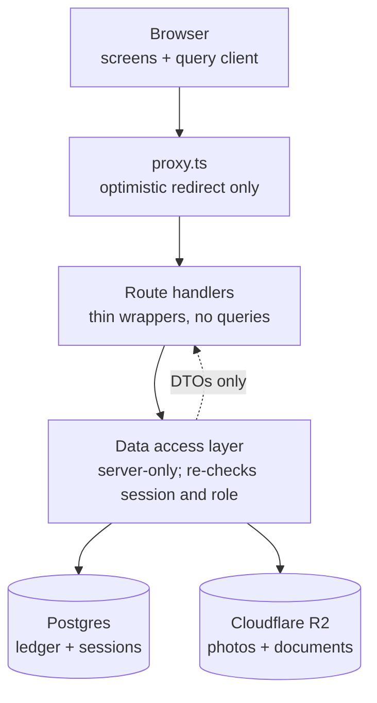
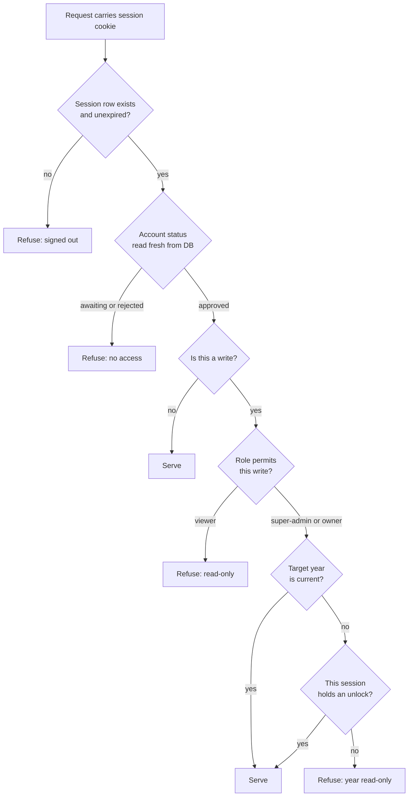

# Server-Backed Multi-User Ledger - Plan

## Goal Capsule

- **Objective.** Move the house ledger off the browser and onto a server, so the owner's brother and father can sign in to their own accounts, and so rent and bills accumulate year after year without a departed tenant's history going with them.
- **Authority hierarchy.** Requirements (R-IDs) win on product behavior. Key Technical Decisions (KTD-IDs) win on implementation mechanism inside the constraints their cited requirements set. Implementation Units override neither. Where a Next.js API is in question, `node_modules/next/dist/docs/` outranks any other source, including this plan.
- **Execution profile.** Build order is foundations first: nothing can be asserted until U1 lands a test harness, and nothing can be stored until U2 lands a schema. Auth precedes every domain endpoint, because the data access layer that endpoints are built on is the thing that enforces it.
- **Stop conditions.** Stop and ask if the work would weaken a requirement, hard-delete data that has money recorded against it, or put an authorization check anywhere other than the data access layer.
- **Tail ownership.** This plan ends at a working local stack with tests green. It does not own deployment, hosting, or CI setup.
- **Open blockers.** None.

---

## Product Contract

### Summary

Rebuild the ledger's data layer on Postgres behind Next.js route handlers, with tenant photos and documents in Cloudflare R2, and put family logins on top. Units, tenants, and bill types each become records the owner manages separately, and rent hangs off a tenancy — one tenant, in one unit, for a stretch of time — so the sheet keeps one column per room while every past payment stays attached to the person who made it.

### Problem Frame

The ledger today is a single-user artifact that exists only in one browser. Everything lives in `localStorage`: the sheet under one key, each tenant photo under another. Clearing site data, switching laptops, or opening the app in a different browser loses the year.

Three structural limits block what the owner now wants. The data model fuses the room and the person into one record — `lib/types.ts:19-31` puts `label` and `floor` alongside `name`, `phone`, and `docs` — so a tenant cannot exist without a unit, and a unit cannot change hands without overwriting whoever lived there before. There is no year dimension at all: bills are a fixed twelve-by-three grid and each unit's rent is a flat twelve-entry array, so recording 2027 means destroying 2026. And the bill types are a hardcoded union of three, so adding an internet line is a code change.

The access problem is newer. The owner's brother and father want to see the numbers, and today that means the owner reading figures aloud or handing over a laptop. Putting the data on a server solves that, but a server holding tenant phone numbers and photographed ID documents with no login is worse than the browser version it replaces — which is why accounts cannot be a later phase.

### Key Decisions

- **Rent belongs to a tenancy, not to a unit or to a person.** A tenancy is one tenant in one unit over a date range, and rent rows hang off it. (session-settled: user-directed — chosen over rent-on-the-unit and rent-on-the-tenant: the only shape where per-room sheet columns and per-tenant history both survive a mid-year turnover.) Governs R10, R11, R12, R13, R14, R15.
- **Bill types are data, house-wide, and retirable.** (session-settled: user-directed — chosen over keeping the hardcoded three and over per-unit metered billing: adding a bill should be a form entry, and the existing sheet already treats every bill as a whole-house cost.) Governs R16, R17, R18.
- **Accounts are self-registered and then approved.** (session-settled: user-directed — chosen over the owner creating accounts directly and over invite codes: family members pick their own password, so no secret is ever transmitted over WhatsApp or paper.) Governs R1, R2, R3.
- **Two permission levels, assigned per account at approval time.** (session-settled: user-directed — chosen over a single view-only level and over making every approved account an editor: which family member helps with data entry is not known in advance.) Governs R4, R5.
- **Only the owner admits new accounts.** A granted super-admin edits every figure and unlocks past years, and still cannot approve a registration or change a role. (session-settled: user-directed — chosen over making a granted super-admin fully equivalent to the owner and over letting super-admins approve viewers only: approval is the system's front door and stays with one person.) Governs R8.
- **The first admin is seeded from environment configuration and can change its own password in the application.** (session-settled: user-directed — chosen over a credential literal in source and over an environment-only credential with no change path: keeps the secret out of every clone and backup while still making exactly one account that nobody can register as.) Governs R6, R7.
- **Past years are read-only until a super-admin unlocks them.** (session-settled: user-directed — chosen over leaving every year editable and over a formal close-year workflow: it stops the current month being typed into last year's sheet without adding a workflow anyone has to remember.) Governs R24, R25.
- **Files live in Cloudflare R2 in both environments, against separate buckets.** (session-settled: user-directed — chosen over MinIO in Docker for local development: one storage client and one code path, at the cost of needing credentials and a network connection to develop.) Governs R26, R30.
- **Files are served through the application, never from public bucket URLs.** A link cannot then outlive the access of the account that fetched it. Governs R27, R28.
- **Deletion is restricted rather than cascading.** (session-settled: user-directed — chosen over never deleting anything and over cascading a delete through recorded amounts: it covers the mistyped-record case without ever orphaning history.) Governs R34.
- **Next.js route handlers are the backend and Postgres is the database, with Postgres in Docker for local development.** Carried from the request; no alternative was examined. Governs R29.
- **TanStack Query owns server state and Zustand owns only client state that never round-trips.** The split is recorded because mirroring cached server data into the store is the failure this pairing invites. Governs R31.

The shape change to the data model:

### Actors

- A1. Owner — the account seeded from environment configuration. Holds every super-admin permission, and is additionally the only actor who approves registrations and sets roles.
- A2. Super-admin — an approved account with edit rights. Records rent and bills, manages units, tenants, tenancies and bill types, and unlocks past years. Cannot approve registrations or change roles.
- A3. Viewer — an approved account with read rights only.
- A4. Applicant — a registered account awaiting a decision. Cannot sign in.
- A5. Tenant — a subject of record, never a user of the system. Has no account and no way to sign in.

### Requirements

**Accounts and access**

- R1. Anyone can register with an email address and a password they choose; registration creates an account that cannot sign in.
- R2. The owner sees every awaiting registration inside the application and either approves it with a role or rejects it.
- R3. An account that is awaiting a decision or has been rejected is refused at sign-in and told which of the two it is.
- R4. Every approved account carries exactly one role: viewer or super-admin.
- R5. A viewer can reach every screen and cannot perform any write anywhere in the application.
- R6. Exactly one owner account is created from environment configuration the first time the application starts, and it cannot be created by registration.
- R7. The owner can change its own password from inside the application by supplying the current one.
- R8. Only the owner approves registrations and assigns or changes roles.
- R9. Passwords are stored only as hashes; no credential is ever compared or persisted in plain text.
- R32. The owner holds every super-admin permission in addition to the account administration in R8.
- R33. Every write re-reads the acting account's current role and status from the database, so a role change or rejection takes effect on that account's next request without a new sign-in.

**Units, tenants, and tenancies**

- R10. Units are created and edited on their own screen, independently of tenants.
- R11. Tenants are created and edited on their own screen, independently of units, and a tenant can exist with no unit attached.
- R12. A tenancy links one tenant to one unit from a start month, with an end month that may be left open, and carries the rent expected each month.
- R13. A unit has at most one tenancy without an end month at any time.
- R14. Ending a tenancy leaves the tenant record and every rent amount already recorded against that tenancy intact.
- R15. A tenant's page lists every tenancy that tenant has held and the rent recorded under each.
- R34. A unit, tenant, tenancy, or bill type can be deleted only when no rent or bill amount references it; anything with amounts against it can only be ended or retired.

**Bills**

- R16. Bill types are records the owner or a super-admin creates, renames, and retires.
- R17. Every bill type is house-wide: one amount per month for the whole property.
- R18. Retiring a bill type removes it from months that have no amount for it and leaves it visible on months that do.
- R35. A retired bill type can be made active again, and reactivating it leaves amounts recorded while it was retired unchanged.

**Recording money**

- R19. Every rent and bill amount carries a paid-or-upcoming status, as it does today.
- R20. The year sheet shows one column per unit and one column per bill type that is active or carries an amount in that year, with the same totals it shows today.
- R21. A month screen lists every active bill type and every unit with a tenancy running in that month.
- R22. A unit with no tenancy running in a given month records no rent for that month.

**Years**

- R23. Every rent and bill amount is scoped to a calendar year, and any year that holds data can be viewed.
- R24. A year other than the current one opens read-only for every account, with its state visible on screen.
- R25. A super-admin can unlock a past year for editing, and the unlock is not remembered beyond the session that opened it.
- R36. An unlock leaves the year read-only for every other session; a second super-admin must unlock the year independently.
- R37. Two writes to the same amount resolve last-write-wins, with no lock and no conflict prompt.

**Files**

- R26. Tenant photos and documents are stored in Cloudflare R2.
- R27. Files are served through the application after a session check and never from a public bucket URL.
- R28. A viewer can open any document or photo and cannot upload, replace, or delete one.

**Platform**

- R29. Postgres is the database and runs in Docker for local development.
- R30. R2 is used in both local development and production, against separate buckets.
- R31. Server data is fetched and cached with TanStack Query; Zustand holds only client state that never round-trips to the server.

The account lifecycle governed by R1 through R4 and R8:

### Key Flows

- F1. A family member gets access
  - **Trigger:** The brother opens the application and has no account.
  - **Actors:** A4, A1
  - **Steps:** He registers with his own password; his account is awaiting a decision and sign-in is refused. The owner opens the application, finds him in the awaiting list, and approves him as a super-admin. He signs in and can record rent.
  - **Covers R1, R2, R3, R4, R8.**

- F2. A unit changes hands mid-year
  - **Trigger:** The tenant in F1(B) leaves at the end of June; a new tenant moves in for July.
  - **Actors:** A1 or A2
  - **Steps:** The departing tenancy is given an end month of June. The tenant record stays, now with no running tenancy. A new tenant is created and a new tenancy opened on F1(B) from July. The sheet keeps its single F1(B) column; January through June stay attached to the first tenancy and July onward to the second.
  - **Covers R11, R12, R13, R14, R15.**

- F3. Recording a month
  - **Trigger:** A super-admin opens the current month.
  - **Actors:** A2
  - **Steps:** The screen lists each active bill type and each unit whose tenancy runs in that month. Amounts are typed and each is marked paid or upcoming. Totals and the year sheet reflect the entries.
  - **Covers R16, R19, R20, R21, R22.**

- F4. Checking a previous year
  - **Trigger:** The father wants last year's total; a super-admin later spots a wrong figure in it.
  - **Actors:** A3, A2
  - **Steps:** The father opens the previous year and sees it read-only, as does every account. The super-admin opens the same year, unlocks it explicitly, corrects the figure, and the unlock lapses when the session ends.
  - **Covers R23, R24, R25.**

### Acceptance Examples

- AE1. Viewer attempts a write
  - **Covers R5, R28.**
  - **Given** an approved account with the viewer role,
  - **When** it opens a month screen and tries to change an amount, mark a status, or delete a document,
  - **Then** no write occurs and the attempt is refused on the server, not only hidden in the interface.

- AE2. Awaiting account attempts sign-in
  - **Covers R1, R3.**
  - **Given** an account that has registered but has not been approved,
  - **When** it submits correct credentials,
  - **Then** sign-in is refused and the response says the account is awaiting approval rather than that the password is wrong.

- AE3. Mid-year handover on the sheet
  - **Covers R12, R14, R15, R20.**
  - **Given** F1(B) held by one tenant January to June and another from July,
  - **When** the year sheet is opened,
  - **Then** F1(B) is one column covering all twelve months, the first tenant's page shows only the January-to-June amounts, and the second tenant's page shows only July onward.

- AE4. Retired bill type on an old year
  - **Covers R18, R20.**
  - **Given** a bill type that carried amounts in the previous year and has since been retired,
  - **When** that previous year is opened,
  - **Then** the retired type still appears as a column with its recorded amounts, and it does not appear on the current year.

- AE5. Past year, locked then unlocked
  - **Covers R24, R25.**
  - **Given** a super-admin viewing a year that is not the current one,
  - **When** they unlock it, change an amount, sign out, and sign in again,
  - **Then** the change persists and the year is read-only once more.

- AE6. Tenant with no unit
  - **Covers R11, R14.**
  - **Given** a tenant whose only tenancy has an end month in the past,
  - **When** the tenants screen is opened,
  - **Then** the tenant is listed with no current unit, and their page still shows every amount recorded during that tenancy.

### Scope Boundaries

**Deferred for later**

- Email of any kind. Approvals are noticed by opening the application, and a forgotten password is reset by the owner rather than by a mailed link.
- An audit trail of which account changed which figure. Three people with edit rights makes this worth having eventually; it is not required to ship.
- Per-unit metered billing, where a bill is recorded against a tenancy and recovered from that tenant.
- A formal close-year action that locks a year for everyone including the owner.
- More than one house or property.

**Outside this product's identity**

- Tenant-facing accounts. Tenants are records in this system and never users of it; a tenant portal is a different product.
- Collecting or processing payments, issuing receipts, or sending rent reminders.
- Generating or e-signing lease documents.

### Dependencies / Assumptions

- A Cloudflare account with R2 enabled and two buckets, one for development and one for production. Local development will not function without R2 credentials and a network connection.
- Docker available locally for Postgres.
- The 2026 figures currently in `lib/seed.ts` become the seed data. Nothing is migrated out of the browser: neither the sheet under the `bills-and-rent:v2` key in `components/house-store.tsx` nor the per-photo keys written by `components/image-slot.tsx`, so any tenant photo or uploaded document in the current browser is lost.
- No data is hidden between approved accounts. A viewer sees tenant phone numbers, photographed identity documents, and yearly totals, and is prevented only from writing. This follows from every account belonging to a family member.
- The existing screens and their design carry over. This plan changes where data comes from and who may change it, not how the ledger looks.
- `AGENTS.md` requires reading `node_modules/next/dist/docs/` before writing Next.js code, because the installed major version differs from common training data.

### Outstanding Questions

**Deferred to implementation**

- How the sheet marks, within one unit column, where one tenancy ends and the next begins. A visual detail; the data supports it either way.
- Whether the password-change flow in R7 is offered to every account or the owner alone. Nothing else depends on the answer.
- The exact argon2id cost parameters, tuned on the machine this runs on from the starting point in U4.
- Whether a tenancy may start and end within one month. The date range in U2 permits it; no requirement needs it.

Planning answered the rest: the session mechanism and its lifetime (KTD1, U4), tenancy boundaries as a date range (KTD6, U2), schema and migration tooling (KTD5), and the visibility of an unlock across sessions (R36). Rent and bill rows are created on first write, not when a year is opened — an untouched year holds no rows, which is what makes a new year need no ceremony.

### Sources / Research

- `lib/types.ts:19-31` — the `Unit` record that fuses room attributes and tenant attributes.
- `lib/types.ts:33-39` — `HouseState` with a fixed twelve-by-three bill grid, twelve-entry rent arrays, and no year field anywhere.
- `lib/seed.ts:18` — `BILL_KINDS`, the hardcoded three bill types.
- `components/house-store.tsx:19` — the sheet's single `localStorage` key.
- `components/image-slot.tsx:58` — the separate per-photo `localStorage` keys, a second storage surface to replace.
- `components/document-panel.tsx:13` — the 1.5 MB cap above which document bytes are dropped today.
- `lib/config.ts:5-9` — house name, currency, and year label as fixed configuration rather than data.
- `package.json` — no Postgres, TanStack Query, Zustand, or authentication dependency present; the whole stack is new work rather than an integration.
- `AGENTS.md` — the installed Next.js major version's documentation requirement.

Framework documentation, read locally and treated as authoritative over any other source:

- `node_modules/next/dist/docs/01-app/02-guides/authentication.md` — the data access layer pattern, and the warning that a proxy matcher does not cover server functions because those post to the route that defines them. Behind KTD2.
- `node_modules/next/dist/docs/01-app/02-guides/upgrading/version-16.md:614,625` — `middleware` is deprecated and renamed to `proxy`. Line 285: synchronous `cookies()`, `headers()`, and `params` are fully removed, so every access awaits.
- `node_modules/next/dist/docs/01-app/03-api-reference/03-file-conventions/instrumentation.md:18` — `register()` runs once and must complete before the server accepts requests. Behind KTD7.
- `node_modules/next/dist/docs/01-app/03-api-reference/03-file-conventions/02-route-segment-config/runtime.md` — Node is the default and Edge is deprecated; the docs say to remove the `runtime` export. Behind KTD8, and the correction to advice that was right for Next 13 through 15.
- `node_modules/next/dist/docs/01-app/01-getting-started/15-route-handlers.md:51` — route handlers are uncached by default. Behind KTD9.
- `node_modules/next/dist/docs/01-app/02-guides/environment-variables.md` — variables without the public prefix stay server-side, and the old runtime-config mechanism is gone.

External research that changed a decision:

- OWASP ranks argon2id first for password storage. Node 22 has no native Argon2, and `@node-rs/argon2` has not released in about two years. Behind KTD3 — and the reason the plan departs from the bcrypt shown in Next's own auth examples.
- Lucia was deprecated by its maintainer in March 2025, and Auth.js is in security-only maintenance. Both are what most tutorials still recommend, which is why KTD4 records the alternatives that were weighed.
- CVE-2025-29927, a middleware authorization bypass scored 9.1, is the concrete precedent behind KTD2's rule that a routing gate is never the authorization boundary. It is patched well before the installed version; it is cited as reasoning, not as an open exposure.
- A Postgres exclusion constraint over a date range with `btree_gist` is the standard way to forbid overlapping validity periods. Behind KTD6.

---

## Planning Contract

**Product Contract preservation:** changed. R25 clarified to say the unlock does not outlive its session. R32–R37 added to close gaps a flow analysis found: the owner's own write authority, live-session role revocation, deletion, bill-type reactivation, unlock visibility across sessions, and concurrent writes. A1 and A2 clarified to match R32. No requirement was weakened or removed, and no R-ID was renumbered.

### Key Technical Decisions

- KTD1. **Sessions are database rows, not stateless signed cookies.** A signed token stays valid until it expires, which would let a rejected or demoted account keep writing. Governs R3, R33.
- KTD2. **Authorization lives in a server-only data access layer that every route handler re-enters.** Next's own guidance is that a proxy matcher does not cover server functions, because those are POSTs to the route that defines them — so a path excluded from the matcher silently excludes its server functions too. `proxy.ts` is used only for optimistic redirects of signed-out visitors, never as the authorization boundary. Governs R5, R33.
- KTD3. **Passwords use argon2id through the `argon2` package.** OWASP ranks argon2id first for password storage. Node 22 has no native Argon2 and `@node-rs/argon2` has not shipped in about two years. Next's own auth guide shows bcrypt in its examples; OWASP is the authority on password storage, so argon2id wins. Governs R9.
- KTD4. **Auth is hand-rolled rather than delegated to a library.** (session-settled: user-directed — chosen over Better Auth and Auth.js/NextAuth: the app needs one email-and-password flow, sessions must be database-backed regardless, and password reset by email is already out of scope, so a library's surface exceeds what it saves.) Governs R1, R7.
- KTD5. **Drizzle with drizzle-kit for schema and migrations.** Chosen over Prisma: generated SQL files stay hand-editable, so the exclusion constraint in KTD6 can be written by hand, and the types are inferred with no codegen step. Prisma's heavier tooling buys little at this size.
- KTD6. **A Postgres exclusion constraint enforces non-overlapping tenancies.** `btree_gist` plus `EXCLUDE USING GIST (unit_id WITH =, period WITH &&)` on a `daterange`. The invariant holds even when two super-admins write at once, which is what makes R37 safe to accept for tenancies. Governs R13.
- KTD7. **The owner account is seeded in `instrumentation.ts`.** Its `register()` runs once per server instance and must complete before the server accepts requests, so no request can arrive before the owner exists. Governs R6.
- KTD8. **No `runtime` export on any route file.** Node is the default in Next 16 and the Edge runtime is deprecated; the docs say to remove the export. Pinning `'nodejs'` is stale advice from Next 13–15.
- KTD9. **No caching directives on route handlers.** They are uncached by default in this configuration, which is the behavior a ledger wants. Adding `force-static` or `revalidate` would introduce staleness that does not exist today.
- KTD10. **The query client is request-scoped on the server and a singleton in the browser, and the client store never holds server data.** A module-level query client shares cache across requests, which in a multi-account app leaks one person's data to another. Governs R31.
- KTD11. **Files stream from R2 through a route handler rather than being served from bucket URLs.** Dev and production use separate buckets with tokens scoped to one bucket each, so a leaked dev credential cannot reach production files. Governs R27, R28, R30.
- KTD12. **Deletion is restricted by foreign keys, not enforced in application code.** The database refuses to remove a row that amounts reference, which makes R34 impossible to violate by forgetting a check. Governs R34.

### High-Level Technical Design

Request path. Every write re-enters the data access layer, which is the only place that talks to Postgres or R2.

Authorization decision, run per request inside the data access layer rather than once at a routing gate.

### Assumptions

- The app runs on one server instance. Session unlocks (R25, R36) are held in the session row, not in process memory, so this assumption is not load-bearing if that changes.
- "Current year" is decided by the server clock at request time, so a tab left open across midnight on 31 December gets its next write refused rather than silently landing in the wrong year.
- The existing 2026 figures in `lib/seed.ts` become the first migration's seed data. Nothing is read out of the browser.
- Tests run against a real Postgres database in Docker, not a mock. The behavior most worth proving — foreign key restriction and the tenancy exclusion constraint — exists only in the database.

### System-Wide Impact

This plan introduces an auth boundary where none existed and moves every byte of state out of the browser, so the blast radius is the whole app.

- **Every screen changes its data source.** All four screens read from `components/house-store.tsx` today. After U11 that module is gone, and any component still importing it breaks the build.
- **Two storage surfaces disappear, not one.** The sheet key and the per-photo keys are separate. Removing only the first leaves orphaned photo data in browsers.
- **A new failure mode arrives: the network.** Every screen can now fail to load or fail to save. The current app cannot fail this way, so no screen has an error or loading state today.
- **Pure calculation survives untouched.** `lib/derive.ts` and `lib/format.ts` operate on plain values and should keep working against server data. They are the seam that makes U11 tractable.
- **Secrets enter the repo's operational surface for the first time.** Database URL, owner credentials, and two R2 token pairs. `.gitignore` already excludes `.env*.local`; nothing else guards them.
- **Local development stops working offline.** R2 is used in both environments by decision, so a developer with no network cannot load or upload a file.

### Risks & Dependencies

- **A viewer that can write is the failure that matters most.** Mitigation: the guard in U3 is written before any endpoint exists, its refusal tests are written first, and no query outside `data/` may touch the database. A hidden button is not a control.
- **Seeding the owner from the environment can silently do nothing.** A typo in a variable name yields a server with no owner and no error. Mitigation: U6 fails loudly on absent variables rather than starting.
- **The exclusion constraint needs an extension that may not be present.** `btree_gist` is bundled with Postgres but not enabled by default. Mitigation: the first migration enables it, so a database that cannot support the constraint fails at migrate time rather than at first overlapping write.
- **Restrict-on-delete surfaces as a raw database error.** Mitigation: U7 catches it and reports what still references the record. An unhandled constraint violation reads as a crash to the user.
- **Argon2id costs memory per hash.** At 64 MB and four accounts this is irrelevant, but the parameters are a knob, not a constant — if sign-in feels slow on the target machine, tune down rather than switching algorithm.
- **Dependencies:** a Cloudflare account with two R2 buckets and a bucket-scoped token for each; Docker available locally; Postgres with `btree_gist`.
- **Version dependency:** this plan is written against the Next.js in `node_modules`. `AGENTS.md` requires reading `node_modules/next/dist/docs/` before writing route, proxy, or instrumentation code, because this major version diverges from widely-held assumptions in ways that already caught two decisions here.

### Sequencing

U1 and U2 are foundations and unblock everything. U3 through U6 build the auth spine, and no domain endpoint can be written before U3 exists because the data access layer is what enforces access. U7, U8, and U10 are the domain surface and can proceed in any order once U3 lands. U9 follows U8, because a year cannot be locked before there are amounts to lock. U11 is last: it swaps the client onto the new endpoints, and needs them to exist.

---

## Implementation Units

| Unit | Title | Key files | Depends on |
|---|---|---|---|
| U1 | Test harness | `package.json`, `vitest.config.ts`, `test/setup.ts` | — |
| U2 | Database, schema, migrations, seed | `docker-compose.yml`, `db/schema.ts`, `db/migrations/` | U1 |
| U3 | Data access layer and session verification | `data/session.ts`, `data/guard.ts` | U2 |
| U4 | Passwords, sessions, sign-in and sign-out | `data/accounts.ts`, `app/api/auth/` | U3 |
| U5 | Registration, approval, role assignment | `app/api/accounts/`, `components/approvals-screen.tsx` | U4 |
| U6 | Owner seeding and password change | `instrumentation.ts`, `app/api/account/password/` | U4 |
| U7 | Units, tenants, tenancies | `data/property.ts`, `app/api/units/`, `app/api/tenants/` | U3 |
| U8 | Bill types and money entry | `data/ledger.ts`, `app/api/bill-types/`, `app/api/entries/` | U3 |
| U9 | Year scoping, read-only past years, unlock | `data/year.ts`, `app/api/years/` | U8 |
| U10 | R2 storage and proxied file serving | `data/files.ts`, `app/api/files/` | U3 |
| U11 | Client rewire onto the server | `components/*-screen.tsx`, `components/query-provider.tsx` | U5, U7, U8, U9, U10 |

### U1. Test harness

- **Goal:** Give the repo a way to assert anything. It has none today — `package.json` carries only `dev`, `build`, `start`, and `typecheck`.
- **Requirements:** Enables the acceptance examples; no product requirement of its own.
- **Dependencies:** none.
- **Files:** `package.json`, `vitest.config.ts`, `test/setup.ts`, `lib/derive.test.ts`.
- **Approach:**
  1. Add Vitest and a `test` script.
  2. Point the config at a Node environment; there is no component-rendering test in this plan.
  3. Add a setup file that loads env from `.env.test` and refuses to run when the database URL is not a test database, so a stray run cannot truncate real data.
  4. Prove the harness on existing pure logic before anything depends on it.
- **Patterns to follow:** `lib/derive.ts` is already pure and dependency-free — the natural first target.
- **Execution note:** Land this before any unit that claims test scenarios. Nothing downstream is assertable until it exists.
- **Test scenarios:**
  - Year and month totals from the seeded figures match the values the current sheet shows.
  - A rent amount of zero formats as a bare `0` and a non-zero amount carries the currency symbol.
  - The setup file throws when the configured database name does not look like a test database.
- **Verification:** `npm test` runs and passes with at least one real assertion over `lib/derive.ts`.

### U2. Database, schema, migrations, seed

- **Goal:** Stand up Postgres in Docker and express the Unit / Tenant / Tenancy / bill-type model as a migration.
- **Requirements:** R10, R12, R13, R17, R23, R29, R34. Realizes KTD5, KTD6, KTD12.
- **Dependencies:** U1.
- **Files:** `docker-compose.yml`, `db/schema.ts`, `db/migrations/`, `db/seed.ts`, `.env.example`, `drizzle.config.ts`, `db/schema.test.ts`.
- **Approach:**
  1. Compose file with one Postgres service and a named volume.
  2. Schema for accounts, sessions, units, tenants, tenancies, bill types, rent entries, and bill entries. Rent and bill entries carry year and month columns (R23).
  3. Tenancies carry a `daterange`. Enable `btree_gist` and add the exclusion constraint in the first migration, not as later hardening.
  4. Foreign keys from entries to their parents use restrict-on-delete, so the database refuses a delete that would orphan money.
  5. Seed the 2026 figures from `lib/seed.ts` so the sheet looks the same on first run.
- **Patterns to follow:** `lib/seed.ts` already holds the real figures in a shape close to what the seed needs.
- **Test scenarios:**
  - Inserting a second open tenancy for a unit that already has one is refused by the database.
  - Two tenancies on the same unit with adjacent, non-overlapping ranges both insert.
  - Deleting a tenant that has rent recorded is refused; deleting a tenant with none succeeds. Covers AE6.
  - After seeding, the year totals equal the figures the current sheet shows.
- **Verification:** `docker compose up -d db` then migrate and seed leaves a database whose totals match the existing sheet.

### U3. Data access layer and session verification

- **Goal:** Build the single place that decides who may do what, before any endpoint exists to forget it.
- **Requirements:** R5, R33. Realizes KTD1, KTD2.
- **Dependencies:** U2.
- **Files:** `data/session.ts`, `data/guard.ts`, `data/guard.test.ts`.
- **Approach:**
  1. `verifySession()` reads the session cookie, loads the session row, and re-reads the account's current role and status from the database on every call (R33).
  2. A guard helper wraps a write and refuses it unless the caller's live role permits it. Every mutation in later units goes through this helper rather than checking inline.
  3. Mark the module server-only so it cannot be imported into a client bundle.
  4. Route handlers get no query access of their own — they call into this layer.
- **Execution note:** Write the refusal tests first. This unit exists to make a class of mistake impossible, and the test is the proof it does.
- **Test scenarios:**
  - Covers AE1. A viewer's session is refused on a write and permitted on a read.
  - An account demoted from super-admin to viewer between two requests is refused on the second, with no new sign-in.
  - An account rejected while its session is live is refused on the next request.
  - An expired session row is refused even when the cookie is intact.
  - A session cookie naming a session id that does not exist is refused.
- **Verification:** Every refusal test passes, and no query outside this layer touches the database.

### U4. Passwords, sessions, sign-in and sign-out

- **Goal:** Let a known account sign in and out.
- **Requirements:** R3, R9. Realizes KTD3, KTD4.
- **Dependencies:** U3.
- **Files:** `data/accounts.ts`, `app/api/auth/sign-in/route.ts`, `app/api/auth/sign-out/route.ts`, `components/sign-in-screen.tsx`, `app/sign-in/page.tsx`, `data/accounts.test.ts`.
- **Approach:**
  1. Hash with argon2id. Start at 64 MB memory, 3 iterations, parallelism 4.
  2. On success, insert a session row and set the cookie with `HttpOnly`, `Secure`, `SameSite=Lax`, `Path=/`, and an expiry that matches the row.
  3. Compare in constant time and return the same refusal for an unknown email as for a wrong password, so the endpoint does not disclose which accounts exist.
  4. Rate-limit sign-in attempts per email and per address. Hand-rolling means this is ours to remember.
  5. Cookies are async in Next 16 — every read and write awaits.
- **Patterns to follow:** shared primitives in `components/ui.tsx` — `Card`, `Button`, `Field`, `Label`, `PageHeading` — and the thin server page that hands off to a client screen, as in `app/units/[key]/page.tsx`.
- **Test scenarios:**
  - Covers AE2. An awaiting account with correct credentials is refused, and the response says it is awaiting approval rather than that the password is wrong.
  - A rejected account with correct credentials is refused and told it was rejected.
  - A wrong password and an unknown email produce the same refusal.
  - Signing out deletes the session row, and the old cookie no longer authenticates.
  - Repeated failed attempts are throttled.
- **Verification:** A seeded owner can sign in, reach a protected read, and sign out.

### U5. Registration, approval, role assignment

- **Goal:** Let a family member register and the owner let them in.
- **Requirements:** R1, R2, R4, R8, R32. Realizes F1.
- **Dependencies:** U4.
- **Files:** `app/api/accounts/route.ts`, `app/api/accounts/[id]/route.ts`, `components/register-screen.tsx`, `components/approvals-screen.tsx`, `app/register/page.tsx`, `app/accounts/page.tsx`, `data/approvals.test.ts`.
- **Approach:**
  1. Registration creates an account in an awaiting state that cannot sign in.
  2. The owner sees awaiting registrations in the app. There is no email, by scope.
  3. Approving assigns viewer or super-admin; rejecting marks the account rejected.
  4. Approval and role changes are owner-only (R8), and the owner otherwise holds every super-admin permission (R32).
  5. Changing a role revokes nothing directly — U3 already re-reads role per request.
- **Patterns to follow:** shared primitives in `components/ui.tsx` — `Card`, `Button`, `Field`, `Label`, `PageHeading` — and the thin server page that hands off to a client screen, as in `app/units/[key]/page.tsx`.
- **Test scenarios:**
  - A registration lands awaiting and cannot sign in until approved. Covers AE2.
  - A super-admin calling the approve endpoint is refused; the owner is permitted.
  - Approving as viewer then attempting a write is refused.
  - Promoting a viewer to super-admin lets the next request write, with no re-sign-in.
  - Registering an email that already exists does not disclose that it exists.
- **Verification:** A second account can be registered, approved, and used to sign in at its granted role.

### U6. Owner seeding and password change

- **Goal:** Guarantee exactly one owner exists before the server serves anything, and let it change its own password.
- **Requirements:** R6, R7. Realizes KTD7.
- **Dependencies:** U4.
- **Files:** `instrumentation.ts`, `app/api/account/password/route.ts`, `components/account-screen.tsx`, `instrumentation.test.ts`.
- **Approach:**
  1. `register()` reads the owner email and password from the environment and upserts the owner. It runs once and completes before the server accepts requests.
  2. Registration can never produce an owner role — the only path is this seed.
  3. The password change requires the current password.
  4. Environment variables carry no `NEXT_PUBLIC_` prefix, so they stay server-side. Document them in `.env.example` with no real values.
- **Patterns to follow:** shared primitives in `components/ui.tsx` — `Card`, `Button`, `Field`, `Label`, `PageHeading` — and the thin server page that hands off to a client screen, as in `app/units/[key]/page.tsx`.
- **Test scenarios:**
  - A first boot against an empty database creates exactly one owner.
  - A second boot does not create a duplicate and does not overwrite a changed password.
  - Booting with the owner variables absent fails loudly rather than starting with no owner.
  - A password change with a wrong current password is refused.
  - After a password change, the old password no longer signs in.
- **Verification:** A fresh `docker compose up` plus first boot yields a signable-in owner with no manual step.

### U7. Units, tenants, tenancies

- **Goal:** Manage rooms and people separately, and the tenancies that join them.
- **Requirements:** R10, R11, R12, R13, R14, R15, R34. Realizes F2.
- **Dependencies:** U3.
- **Files:** `data/property.ts`, `app/api/units/route.ts`, `app/api/tenants/route.ts`, `app/api/tenancies/route.ts`, `data/property.test.ts`.
- **Approach:**
  1. Separate create and edit paths for units and tenants; assignment is its own action (R11).
  2. Ending a tenancy sets its end month and leaves rent recorded against it untouched.
  3. Deletes are attempted and the database's refusal is surfaced as a clear message naming what still references the record.
  4. A tenant's history reads across every tenancy they have held (R15).
- **Test scenarios:**
  - Covers AE3. A unit handed over mid-year keeps one column, and each tenant's page shows only their own months.
  - Covers AE6. A tenant whose only tenancy has ended still lists every amount recorded during it.
  - Deleting a unit with a tenancy is refused; deleting a unit created by mistake with nothing against it succeeds.
  - Opening a second tenancy on a unit that already has an open one is refused.
  - A tenancy spanning a year boundary reports rent under both years.
- **Verification:** The mid-year handover in the flows can be performed end to end and both tenant pages read correctly.

### U8. Bill types and money entry

- **Goal:** Make bill types data, and record rent and bill amounts against a year and month.
- **Requirements:** R16, R17, R18, R19, R20, R21, R22, R23, R35, R37. Realizes F3.
- **Dependencies:** U3.
- **Files:** `data/ledger.ts`, `app/api/bill-types/route.ts`, `app/api/entries/route.ts`, `data/ledger.test.ts`.
- **Approach:**
  1. Bill types become rows with an active flag; retiring flips it (R18) and reactivating flips it back (R35).
  2. Entries carry year, month, amount, and paid-or-upcoming status.
  3. A month lists active bill types and units whose tenancy runs in that month (R21, R22).
  4. Writes are last-write-wins by decision (R37) — no locking, no conflict prompt.
- **Test scenarios:**
  - Covers AE4. A bill type retired this year still shows on last year's sheet with its amounts, and is absent from this year's.
  - A reactivated bill type reappears without altering amounts recorded while retired.
  - A unit with no tenancy in a month records no rent for it.
  - Two writes to the same amount leave the second value.
  - A month total equals the sum of its entries after each write.
- **Verification:** Adding a bill type shows a new column on the year sheet with the totals still correct.

### U9. Year scoping, read-only past years, unlock

- **Goal:** Keep every year, and protect the ones already recorded.
- **Requirements:** R23, R24, R25, R36. Realizes F4.
- **Dependencies:** U8.
- **Files:** `data/year.ts`, `app/api/years/[year]/unlock/route.ts`, `data/year.test.ts`.
- **Approach:**
  1. The server decides the current year at request time.
  2. A write to any other year is refused unless the calling session holds an unlock for it.
  3. The unlock is stored on the session row, so it dies with the session and is invisible to others (R36).
  4. Navigating to a year with no data yields empty cells rather than an error — units, tenancies, and active bill types are already there.
- **Test scenarios:**
  - Covers AE5. A super-admin unlocks a past year, writes, signs out and back in, and finds the change persisted and the year read-only again.
  - A second super-admin sees the same year read-only while the first holds an unlock.
  - A viewer cannot unlock at all.
  - A write to a past year without an unlock is refused server-side even when the request is made directly.
  - A tab holding an unlock for the year that stops being current has its next write refused.
- **Verification:** A past year is read-only for everyone, and unlocking affects only the session that asked.

### U10. R2 storage and proxied file serving

- **Goal:** Move tenant photos and documents out of the browser and serve them only to accounts that may see them.
- **Requirements:** R26, R27, R28, R30. Realizes KTD8, KTD11.
- **Dependencies:** U3.
- **Files:** `data/files.ts`, `app/api/files/route.ts`, `app/api/files/[id]/route.ts`, `data/files.test.ts`.
- **Approach:**
  1. Use the S3-compatible client against the R2 endpoint. Separate buckets for development and production, each with a token scoped to that bucket alone.
  2. Downloads stream the object body straight into the response rather than buffering it.
  3. Every download re-enters the data access layer first — no bucket URL is ever handed out.
  4. Do not set a `runtime` export. Node is already the default and Edge is deprecated (KTD8).
  5. Store file metadata in Postgres and the bytes in R2.
- **Test scenarios:**
  - A signed-out request for a file is refused.
  - A viewer can download a document and is refused on upload and delete.
  - A file id belonging to another record cannot be fetched by guessing the id.
  - An upload records its metadata and the object is retrievable.
  - Deleting a document removes both the row and the object.
- **Verification:** A document uploaded through the app can be reopened after a restart, and never resolves to a public URL.

### U11. Client rewire onto the server

- **Goal:** Point the four existing screens at the new endpoints and delete the browser store.
- **Requirements:** R20, R21, R31.
- **Dependencies:** U5, U7, U8, U9, U10.
- **Files:** `components/query-provider.tsx`, `components/house-store.tsx` (removed), `components/year-sheet.tsx`, `components/month-screen.tsx`, `components/units-screen.tsx`, `components/tenant-screen.tsx`, `components/image-slot.tsx`, `components/document-panel.tsx`, `app/layout.tsx`, `components/year-sheet.test.ts`.
- **Approach:**
  1. Add a query provider whose client is request-scoped on the server and a singleton in the browser (KTD10). Set a non-zero stale time so hydrated queries do not refetch immediately.
  2. Replace the reducer and its `localStorage` writes with queries and mutations. Remove both storage surfaces — the sheet key and the per-photo keys.
  3. Keep the client store for view state only: which year is selected, open forms, unsaved drafts. Nothing that came from the server goes into it.
  4. Hide controls a viewer may not use, on top of the server refusal that already exists — never instead of it.
  5. Leave the visual design alone. The screens keep their current look.
- **Patterns to follow:** the existing split of thin server pages that await `params` and hand off to a client screen, as in `app/units/[key]/page.tsx`; shared primitives in `components/ui.tsx`; pure calculations in `lib/derive.ts`, which should keep working against server data.
- **Test scenarios:**
  - Year and month totals rendered from server data match what `lib/derive.ts` computes.
  - No `localStorage` key is written by any screen after the rewire.
  - A viewer sees the sheet and sees no edit controls.
  - Switching year refetches rather than reading a stale cache.
  - A failed mutation surfaces an error and does not leave the screen showing a value the server rejected.
- **Verification:** `npm run build` passes, every screen loads from Postgres, and clearing browser storage loses nothing.

---

## Verification Contract

| Gate | Command | Applies to |
|---|---|---|
| Types | `npm run typecheck` | every unit |
| Build | `npm run build` | U11, and any unit touching route files |
| Tests | `npm test` | U1 onward |
| Database up | `docker compose up -d db` | prerequisite for U2 onward |
| Migrations | `npx drizzle-kit migrate` | U2 onward |

Quality gates:

- The six acceptance examples in the Product Contract are each asserted at the server boundary, not in the interface.
- Every refusal test in U3 passes. A viewer who can write anything is a failed gate, not a bug to file.
- No query outside `data/` touches Postgres or R2.
- No `localStorage` write remains in any component after U11.

There is no browser automation in this plan. Nothing in the test suite clicks through a real sign-in.

## Definition of Done

Global:

- Every requirement R1 through R37 is either implemented or named in Scope Boundaries as out of scope.
- `npm run typecheck`, `npm run build`, and `npm test` all pass.
- A fresh clone plus `docker compose up -d db`, migrate, and seed yields a signable-in owner and a 2026 sheet matching the figures the app shows today.
- Both browser storage surfaces are gone: the sheet key and the per-photo keys.
- No credential appears in any tracked file. `.env.example` documents the variables with no real values.
- Dev and production R2 tokens are each scoped to a single bucket.
- Abandoned approaches are removed. A long build accumulates dead ends, and leaving them in the diff is not done.

Per unit: the unit's own test scenarios pass, and the gates its files trigger are green.
